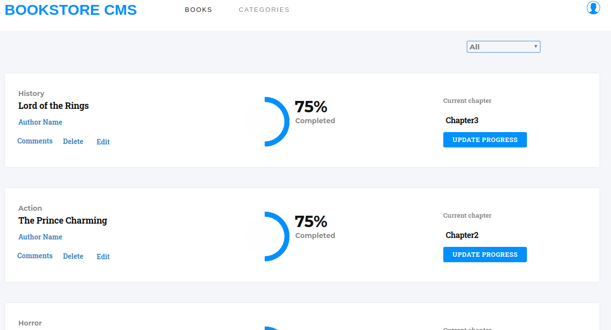

# REACT BOOKSTORE

This is a front-end application built with React & Redux that helps organize and manage a bookstore application. It is fast, dynamic and responsive to the specified actions.

This project has 5 milestones:
- The 1ST MileStone: The first step focuses on the project setup, by removing the unnecessary files created by the create-react-app, setting up linters for creating error free PRs. Also, adding the proptypes, react-redux and redux dependencies with the following syntax:

``` 
npm install react-redux redux 
```

- The 2ND MileStone:

## Built With
- Node.js
- React
- React-Create-App
- Redux
- npm
- JSX
- JavaScript ES6
- CSS
- Heroku
- Jest



## Getting Started
```
# Clone this repository
$ git clone https://github.com/okikiola11/bookstore.git

$ cd bookstore
$ npm start
```

## Live link
Click <a href="https://booksttore.herokuapp.com/">Bookstore application</a>

## Available Scripts

Inorder to use the applicaton in the project directory, you can run:

- `npm install`
- `npm start`
- `npm test`
- `npm run build`

## Learn More

You can learn more in the [Create React App documentation](https://facebook.github.io/create-react-app/docs/getting-started).

To learn React, check out the [React documentation](https://reactjs.org/).


## Author

👤 Apelehin Okikiola

- Github: [@okikiola11](https://github.com/okikiola11)
- Twitter: [@Kikiolla3](https://twitter.com/Kikiolla3)
- LinkedIn: [@okikiola-apelehin](https://www.linkedin.com/in/okikiola-apelehin-459008122/)


## 🤝 Contributing
 Contributions, issues and feature requests are welcome!
 -- create an issue <a href="https://github.com/okikiola11/bookstore/issues">here</a>

## Show your support 
Give a ⭐️ if you like this project!
